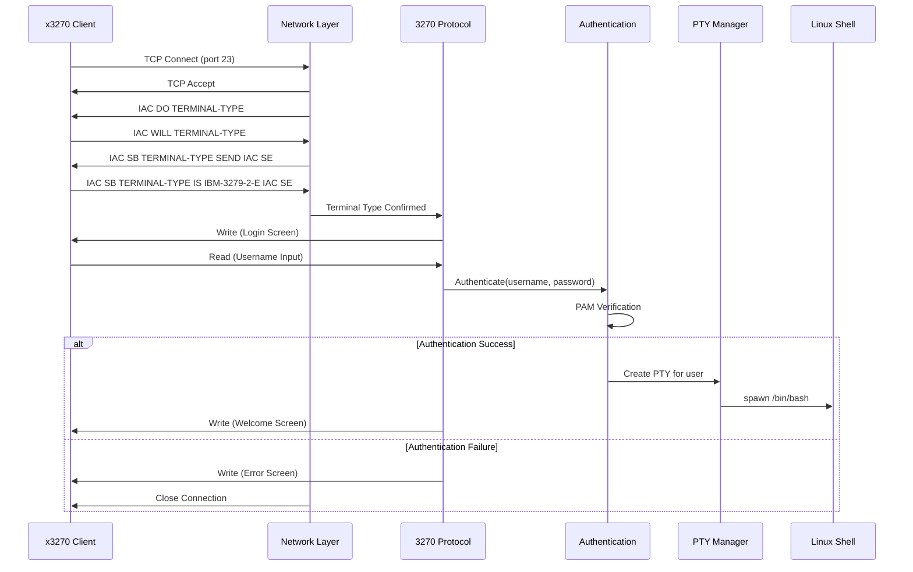
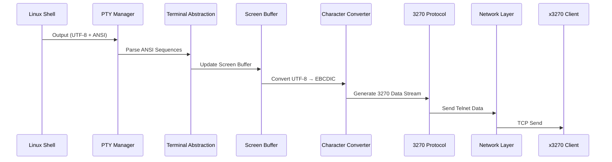
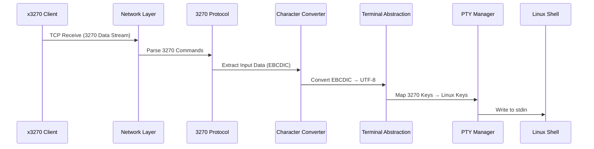
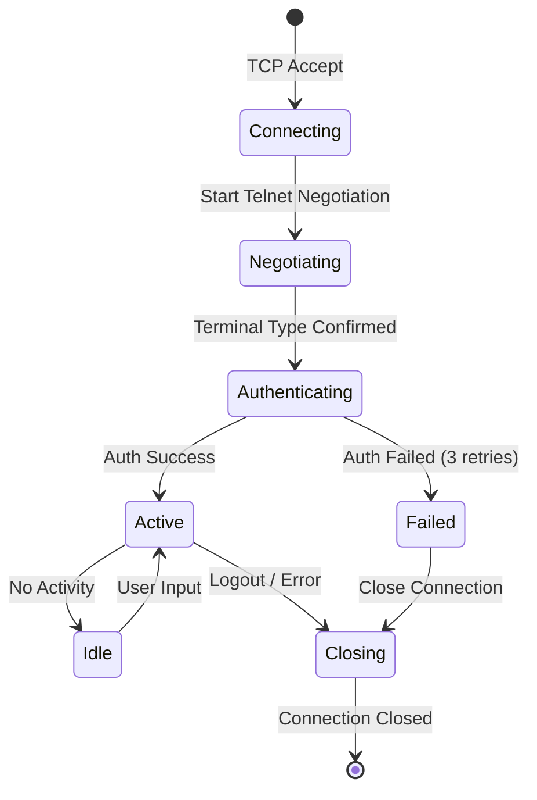
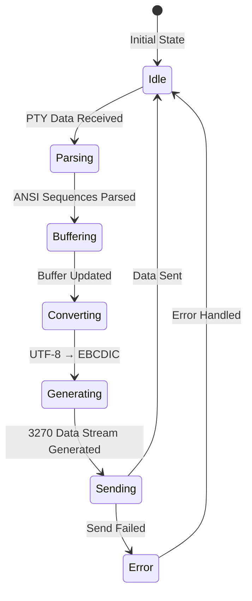
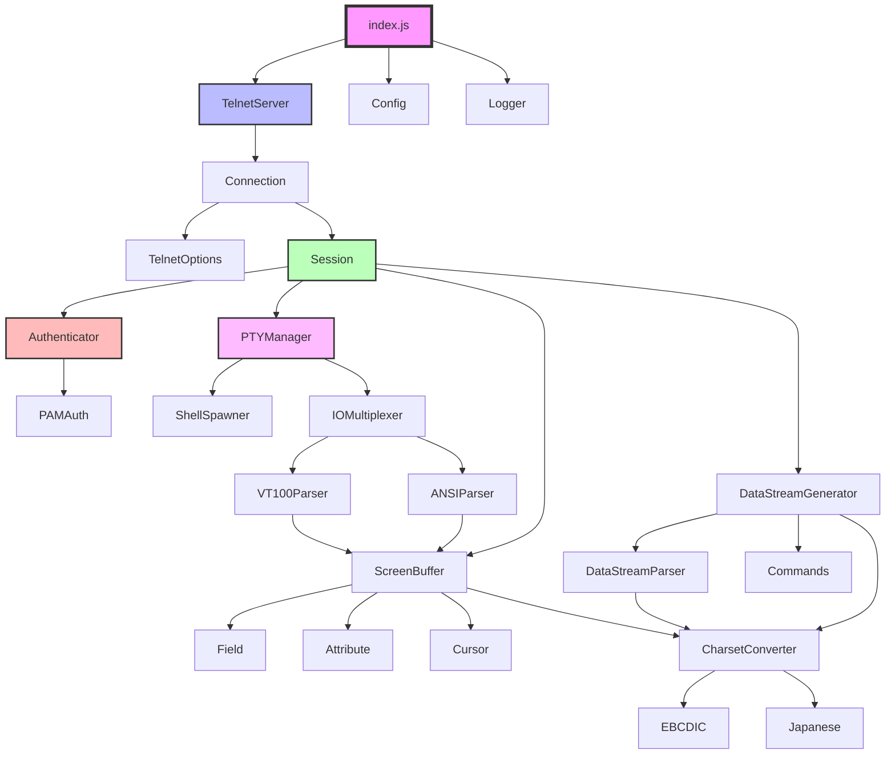

# TN3270 Server - アーキテクチャ詳細

## データフロー

### 接続確立フロー



### データ送信フロー（Shell → Client）



### データ受信フロー（Client → Shell）



---

## 状態遷移図

### 接続状態



### 画面更新状態



---

## コンポーネント間の依存関係



---

## レイヤー間のインターフェース

### 1. Network Layer → 3270 Protocol Layer

```javascript
interface NetworkToProtocol {
  /**
   * 接続確立通知
   * @param connection - 接続オブジェクト
   * @param terminalType - 端末タイプ（例: "IBM-3279-2-E"）
   */
  onConnectionEstablished(connection, terminalType);
  
  /**
   * データ受信通知
   * @param connection - 接続オブジェクト
   * @param data - 受信データ（Buffer）
   */
  onDataReceived(connection, data);
  
  /**
   * 接続切断通知
   * @param connection - 接続オブジェクト
   * @param reason - 切断理由
   */
  onConnectionClosed(connection, reason);
}
```

### 2. 3270 Protocol Layer → Character Conversion Layer

```javascript
interface ProtocolToCharset {
  /**
   * EBCDIC → UTF-8 変換
   * @param ebcdic - EBCDICバイト列
   * @returns UTF-8文字列
   */
  ebcdicToUtf8(ebcdic: Buffer): string;
  
  /**
   * UTF-8 → EBCDIC 変換
   * @param utf8 - UTF-8文字列
   * @returns EBCDICバイト列
   */
  utf8ToEbcdic(utf8: string): Buffer;
  
  /**
   * 文字幅取得
   * @param char - 文字
   * @returns 1 (半角) or 2 (全角)
   */
  getCharWidth(char: string): number;
}
```

### 3. Screen Buffer Manager → 3270 Protocol Layer

```javascript
interface ScreenToProtocol {
  /**
   * 画面全体を3270データストリームに変換
   * @param buffer - 画面バッファ
   * @returns 3270データストリーム
   */
  generateEraseWrite(buffer: ScreenBuffer): Buffer;
  
  /**
   * 変更部分のみを3270データストリームに変換
   * @param changes - 変更リスト
   * @returns 3270データストリーム
   */
  generateWrite(changes: Array<Change>): Buffer;
  
  /**
   * カーソル位置を設定
   * @param row - 行
   * @param col - 列
   * @returns 3270コマンド
   */
  generateSetCursor(row: number, col: number): Buffer;
}
```

### 4. Terminal Abstraction Layer → Screen Buffer Manager

```javascript
interface TerminalToScreen {
  /**
   * 文字を書き込み
   * @param row - 行
   * @param col - 列
   * @param char - 文字
   * @param attr - 属性
   */
  writeChar(row: number, col: number, char: string, attr: Attribute): void;
  
  /**
   * 画面をクリア
   */
  clearScreen(): void;
  
  /**
   * カーソルを移動
   * @param row - 行
   * @param col - 列
   */
  moveCursor(row: number, col: number): void;
  
  /**
   * スクロール
   * @param lines - スクロール行数（正=下、負=上）
   */
  scroll(lines: number): void;
}
```

### 5. Authentication Layer → PTY Manager

```javascript
interface AuthToPTY {
  /**
   * PTYを作成
   * @param userContext - ユーザーコンテキスト
   * @returns PTYオブジェクト
   */
  createPTY(userContext: UserContext): PTY;
  
  /**
   * PTYを破棄
   * @param pty - PTYオブジェクト
   */
  destroyPTY(pty: PTY): void;
}

interface UserContext {
  username: string;
  uid: number;
  gid: number;
  home: string;
  shell: string;
  env: Record<string, string>;
}
```

### 6. PTY Manager → Terminal Abstraction Layer

```javascript
interface PTYToTerminal {
  /**
   * PTY出力を処理
   * @param data - PTY出力データ（UTF-8 + ANSI）
   */
  processPTYOutput(data: string): void;
  
  /**
   * 端末サイズ変更通知
   * @param rows - 行数
   * @param cols - 列数
   */
  onTerminalResize(rows: number, cols: number): void;
}
```

---

## データ構造

### 1. 3270 Data Stream

```javascript
/**
 * 3270データストリーム構造
 */
class DataStream {
  command: number;        // コマンドコード (0x01, 0x05, etc.)
  wcc: number;           // Write Control Character
  orders: Array<Order>;  // オーダーリスト
  data: Buffer;          // データ部分
}

/**
 * 3270オーダー
 */
class Order {
  type: number;          // オーダータイプ (SF, SBA, etc.)
  params: Array<any>;    // パラメータ
}

/**
 * 3270フィールド属性
 */
class FieldAttribute {
  protected: boolean;    // 保護フィールド
  numeric: boolean;      // 数値のみ
  display: boolean;      // 表示/非表示
  intensified: boolean;  // 高輝度
  modified: boolean;     // MDT
  color: string;         // 色
}
```

### 2. Screen Buffer

```javascript
/**
 * 画面バッファ構造
 */
class ScreenBuffer {
  rows: number;                           // 行数 (24)
  cols: number;                           // 列数 (80)
  buffer: Array<Array<Cell>>;            // セル配列
  cursor: { row: number, col: number };  // カーソル位置
  fields: Array<Field>;                  // フィールドリスト
  modified: boolean;                     // 変更フラグ
}

/**
 * セル
 */
class Cell {
  char: string;          // 文字
  attr: Attribute;       // 属性
  modified: boolean;     // 変更フラグ
}

/**
 * 属性
 */
class Attribute {
  fg: string;            // 前景色
  bg: string;            // 背景色
  bold: boolean;         // 太字
  underline: boolean;    // 下線
  reverse: boolean;      // 反転
  blink: boolean;        // 点滅
}
```

### 3. Session

```javascript
/**
 * セッション構造
 */
class Session {
  sessionId: string;              // セッションID
  username: string;               // ユーザー名
  connection: Connection;         // 接続
  pty: PTY;                       // PTY
  screenBuffer: ScreenBuffer;     // 画面バッファ
  state: SessionState;            // 状態
  createdAt: Date;                // 作成日時
  lastActivity: Date;             // 最終アクティビティ
  authRetries: number;            // 認証リトライ回数
}

/**
 * セッション状態
 */
enum SessionState {
  CONNECTING = 'connecting',
  NEGOTIATING = 'negotiating',
  AUTHENTICATING = 'authenticating',
  ACTIVE = 'active',
  IDLE = 'idle',
  CLOSING = 'closing',
  CLOSED = 'closed'
}
```

### 4. VT100 Command

```javascript
/**
 * VT100コマンド
 */
class VT100Command {
  type: VT100CommandType;
  params: Array<any>;
}

/**
 * VT100コマンドタイプ
 */
enum VT100CommandType {
  CURSOR_MOVE = 'cursor_move',
  CLEAR_SCREEN = 'clear_screen',
  CLEAR_LINE = 'clear_line',
  SET_ATTRIBUTE = 'set_attribute',
  SCROLL_UP = 'scroll_up',
  SCROLL_DOWN = 'scroll_down',
  INSERT_LINE = 'insert_line',
  DELETE_LINE = 'delete_line',
  INSERT_CHAR = 'insert_char',
  DELETE_CHAR = 'delete_char'
}
```

---

## パフォーマンス最適化

### 1. 差分更新アルゴリズム

```javascript
/**
 * 画面バッファの差分を計算
 */
class DiffCalculator {
  /**
   * 2つのバッファを比較して変更箇所を抽出
   * @param oldBuffer - 旧バッファ
   * @param newBuffer - 新バッファ
   * @returns 変更リスト
   */
  diff(oldBuffer, newBuffer) {
    const changes = [];
    
    for (let row = 0; row < newBuffer.rows; row++) {
      let changeStart = -1;
      let changeEnd = -1;
      
      for (let col = 0; col < newBuffer.cols; col++) {
        const oldCell = oldBuffer.buffer[row][col];
        const newCell = newBuffer.buffer[row][col];
        
        if (!this.cellsEqual(oldCell, newCell)) {
          if (changeStart === -1) {
            changeStart = col;
          }
          changeEnd = col;
        } else if (changeStart !== -1) {
          // 変更範囲が終了
          changes.push({
            row,
            startCol: changeStart,
            endCol: changeEnd,
            data: newBuffer.buffer[row].slice(changeStart, changeEnd + 1)
          });
          changeStart = -1;
          changeEnd = -1;
        }
      }
      
      // 行末まで変更が続いている場合
      if (changeStart !== -1) {
        changes.push({
          row,
          startCol: changeStart,
          endCol: changeEnd,
          data: newBuffer.buffer[row].slice(changeStart, changeEnd + 1)
        });
      }
    }
    
    return changes;
  }
  
  /**
   * セルが等しいか判定
   */
  cellsEqual(cell1, cell2) {
    return cell1.char === cell2.char &&
           this.attributesEqual(cell1.attr, cell2.attr);
  }
  
  /**
   * 属性が等しいか判定
   */
  attributesEqual(attr1, attr2) {
    return attr1.fg === attr2.fg &&
           attr1.bg === attr2.bg &&
           attr1.bold === attr2.bold &&
           attr1.underline === attr2.underline &&
           attr1.reverse === attr2.reverse;
  }
}
```

### 2. バッファリング戦略

```javascript
/**
 * 出力バッファリング
 */
class OutputBuffer {
  constructor(flushInterval = 50) {
    this.buffer = [];
    this.flushInterval = flushInterval;
    this.timer = null;
  }
  
  /**
   * データを追加
   */
  write(data) {
    this.buffer.push(data);
    
    // タイマーが設定されていなければ設定
    if (!this.timer) {
      this.timer = setTimeout(() => {
        this.flush();
      }, this.flushInterval);
    }
  }
  
  /**
   * バッファをフラッシュ
   */
  flush() {
    if (this.buffer.length > 0) {
      const combined = Buffer.concat(this.buffer);
      this.send(combined);
      this.buffer = [];
    }
    
    if (this.timer) {
      clearTimeout(this.timer);
      this.timer = null;
    }
  }
  
  /**
   * 実際の送信処理
   */
  send(data) {
    // 実装は派生クラスで
  }
}
```

### 3. キャッシング

```javascript
/**
 * 文字コード変換キャッシュ
 */
class ConversionCache {
  constructor(maxSize = 1000) {
    this.cache = new Map();
    this.maxSize = maxSize;
  }
  
  /**
   * キャッシュから取得
   */
  get(key) {
    return this.cache.get(key);
  }
  
  /**
   * キャッシュに設定
   */
  set(key, value) {
    // LRU: 最大サイズを超えたら古いエントリを削除
    if (this.cache.size >= this.maxSize) {
      const firstKey = this.cache.keys().next().value;
      this.cache.delete(firstKey);
    }
    
    this.cache.set(key, value);
  }
  
  /**
   * キャッシュをクリア
   */
  clear() {
    this.cache.clear();
  }
}
```

---

## エラーハンドリング戦略

### エラー分類

```javascript
/**
 * エラータイプ
 */
enum ErrorType {
  NETWORK = 'network',
  PROTOCOL = 'protocol',
  AUTH = 'auth',
  PTY = 'pty',
  CHARSET = 'charset',
  SYSTEM = 'system',
  UNKNOWN = 'unknown'
}

/**
 * エラーハンドラー
 */
class ErrorHandler {
  /**
   * エラーを処理
   */
  handle(error, context) {
    // 1. エラーをログに記録
    logger.error({
      type: error.type,
      message: error.message,
      stack: error.stack,
      context
    });
    
    // 2. エラー種別に応じた処理
    switch (error.type) {
      case ErrorType.NETWORK:
        return this.handleNetworkError(error, context);
      case ErrorType.PROTOCOL:
        return this.handleProtocolError(error, context);
      case ErrorType.AUTH:
        return this.handleAuthError(error, context);
      case ErrorType.PTY:
        return this.handlePTYError(error, context);
      case ErrorType.CHARSET:
        return this.handleCharsetError(error, context);
      default:
        return this.handleUnknownError(error, context);
    }
  }
  
  /**
   * ネットワークエラー処理
   */
  handleNetworkError(error, context) {
    const { connection } = context;
    
    // 接続をクローズ
    if (connection) {
      connection.close();
    }
    
    return { action: 'close', reason: 'network_error' };
  }
  
  /**
   * プロトコルエラー処理
   */
  handleProtocolError(error, context) {
    const { connection } = context;
    
    // エラー画面を表示
    if (connection) {
      this.sendErrorScreen(connection, error.message);
    }
    
    // 継続可能なら継続
    if (error.recoverable) {
      return { action: 'continue' };
    } else {
      return { action: 'close', reason: 'protocol_error' };
    }
  }
  
  /**
   * 認証エラー処理
   */
  handleAuthError(error, context) {
    const { session } = context;
    
    session.authRetries++;
    
    if (session.authRetries >= 3) {
      // 3回失敗したら接続をクローズ
      return { action: 'close', reason: 'auth_failed' };
    } else {
      // リトライを促す
      this.sendAuthRetryScreen(session.connection);
      return { action: 'retry' };
    }
  }
  
  /**
   * PTYエラー処理
   */
  handlePTYError(error, context) {
    const { session } = context;
    
    // PTYを再作成
    try {
      session.pty.close();
      session.pty = this.createPTY(session.userContext);
      return { action: 'continue' };
    } catch (e) {
      // 再作成に失敗したらセッションをクローズ
      return { action: 'close', reason: 'pty_error' };
    }
  }
  
  /**
   * 文字コードエラー処理
   */
  handleCharsetError(error, context) {
    // 置換文字で代替
    logger.warn('Charset conversion error, using replacement character');
    return { action: 'continue', replacement: '?' };
  }
}
```

---

## セキュリティ設計

### 1. 認証フロー

```javascript
/**
 * 認証フロー
 */
class AuthenticationFlow {
  async authenticate(username, password) {
    // 1. ユーザー名の検証
    if (!this.validateUsername(username)) {
      throw new AuthError('Invalid username');
    }
    
    // 2. 拒否リストのチェック
    if (this.isDeniedUser(username)) {
      throw new AuthError('User denied');
    }
    
    // 3. PAM認証
    const pamResult = await this.pamAuth.authenticate(username, password);
    if (!pamResult.success) {
      throw new AuthError('Authentication failed');
    }
    
    // 4. グループチェック（設定されている場合）
    if (config.auth.requireGroup) {
      const groups = await this.getUserGroups(username);
      if (!groups.includes(config.auth.requireGroup)) {
        throw new AuthError('User not in required group');
      }
    }
    
    // 5. ユーザー情報を取得
    const userInfo = await this.getUserInfo(username);
    
    return {
      success: true,
      userContext: {
        username,
        uid: userInfo.uid,
        gid: userInfo.gid,
        home: userInfo.home,
        shell: userInfo.shell
      }
    };
  }
}
```

### 2. アクセス制御

```javascript
/**
 * アクセス制御
 */
class AccessControl {
  /**
   * 接続を許可するか判定
   */
  canConnect(remoteAddress) {
    // 1. 最大接続数チェック
    if (this.getActiveConnectionCount() >= config.server.maxConnections) {
      return { allowed: false, reason: 'max_connections' };
    }
    
    // 2. IPアドレスチェック（将来の拡張）
    // if (this.isBlockedIP(remoteAddress)) {
    //   return { allowed: false, reason: 'blocked_ip' };
    // }
    
    return { allowed: true };
  }
  
  /**
   * ユーザーごとの接続数チェック
   */
  canUserConnect(username) {
    const userConnections = this.getUserConnectionCount(username);
    
    if (userConnections >= config.server.maxConnectionsPerUser) {
      return { allowed: false, reason: 'max_user_connections' };
    }
    
    return { allowed: true };
  }
}
```

### 3. ログ記録

```javascript
/**
 * セキュリティログ
 */
class SecurityLogger {
  /**
   * 接続ログ
   */
  logConnection(sessionId, remoteAddress, terminalType) {
    logger.info({
      event: 'connection.established',
      sessionId,
      remoteAddress,
      terminalType,
      timestamp: new Date().toISOString()
    });
  }
  
  /**
   * 認証成功ログ
   */
  logAuthSuccess(sessionId, username) {
    logger.info({
      event: 'auth.success',
      sessionId,
      username,
      timestamp: new Date().toISOString()
    });
  }
  
  /**
   * 認証失敗ログ
   */
  logAuthFailure(sessionId, username, reason) {
    logger.warn({
      event: 'auth.failure',
      sessionId,
      username,
      reason,
      timestamp: new Date().toISOString()
    });
  }
  
  /**
   * 切断ログ
   */
  logDisconnection(sessionId, reason) {
    logger.info({
      event: 'connection.closed',
      sessionId,
      reason,
      timestamp: new Date().toISOString()
    });
  }
}
```

---

## 次のステップ

アーキテクチャ設計が完了しました。次は以下のドキュメントを作成します：

1. **[PROTOCOL.md](PROTOCOL.md)** - 3270プロトコル仕様の詳細
2. **[IMPLEMENTATION.md](IMPLEMENTATION.md)** - 各モジュールの実装仕様
3. **[TESTING.md](TESTING.md)** - テスト計画とテストケース